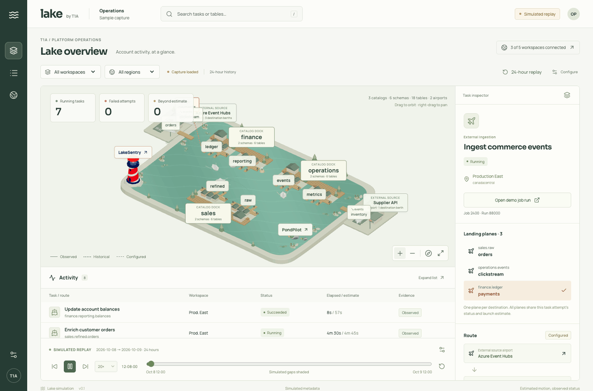

# SimLake

SimLake by T1A is a local lake visualization for replaying the previous 24 hours of Databricks job history. Catalogs are docks, schemas are piers, and tables are berths. Paper planes carry external ingestion to each observed destination; paper ships follow table transformations. Unresolved or multi-input routes remain processing buoys.

The lake is the main view. Playback starts at **60×: one minute of history per second of animation**. Navigation, activity, the timeline, and ordinary captions are hidden initially. Use **Replay** to reveal the minute-level timeline and **View options → Show captions** for labels. Click a vessel or dock to open its details. LakeSentry, 8FDE, and PondPilot retain their labels; the Antares shore tower displays its official logo, and SecondStack’s logo is printed on a moored sailboat’s sails.



_Recorded from the running app with explicitly simulated metadata and 60× playback. The swimming mascots use an independent ambient clock._

## What the lake shows

- **Catalog docks → schema piers → table berths.** Inventory determines lake size; its depth grows with shore length to keep large inventories from becoming a narrow strip. Positions stay stable during filtering and seeking. Empty catalogs and schemas retain their place.
- **One plane per landing destination.** A job writing to several tables can have several planes. Each opens the same job-run status and its destination details without inflating execution counts.
- **Paper ships and processing buoys.** A single observed table source can drive a transformation route. Missing or ambiguous lineage remains visibly unresolved.
- **Fixed 24-hour replay.** Minute-level seeking, event navigation, playback speeds, workspace filters, an accessible activity list, and contextual inspection use a saved capture. No live collection runs in the background.
- **A natural landscape.** Docks attach to shore; inland airports, forests, crop fields, country roads, reeds, and ripples surround the lake. Reserved corridors and deterministic yielding reduce vessel overlaps.
- **Linked landmarks.** A pale [LakeSentry](https://lakesentry.io/) lighthouse, [PondPilot](https://pondpilot.io/) ducks, [8FDE](https://8fde.ai/) octopus, [Antares](https://getantares.io/) skyscraper, and [SecondStack](https://secondstack.ai/) sailboat open their homepages. The sailboat carries the official SecondStack mark and wordmark on both sides of its sails, with a keyboard-accessible link. Its quiet shore mooring stays clear of ship routes and swimming lanes; gentle bobbing continues independently of replay. Ducks and octopus keep swimming while playback is paused or finished. Reduced motion keeps them visible and stationary.

React, TypeScript, Three.js, and React Three Fiber render the scene. A Python FastAPI backend reads Databricks system tables through SQL Statement Execution and saves fixed captures in local SQLite. A visibly labeled simulated capture makes the app usable before a workspace is connected.

## Run locally

Requires Node.js 22.12+ and Python 3.11+.

```sh
python3 -m venv .venv
.venv/bin/python -m pip install -r requirements-dev.txt
npm ci
npm run build
.venv/bin/python -m uvicorn backend.app:app --host 127.0.0.1 --port 8001
```

Open [SimLake](http://127.0.0.1:8001/). For frontend development, run `npm run dev` and open port 5173; Vite proxies the API to port 8001.

## Configure one integration workspace

1. Open the settings button in the header, **Configure replay**.
2. Enter the workspace name and HTTPS workspace URL. Choose **Databricks CLI · OAuth** and enter an existing CLI profile name, or choose **Access token** to paste a token. The region label is optional.
3. Enter a SQL warehouse ID, or leave it blank to use an accessible running warehouse. An explicitly selected stopped warehouse may start when Databricks executes the metadata queries.
4. Save the connection. **Test saved connection** checks access to job, task, and lineage system tables.
5. Select the integration workspace and click **Import last 24 hours**. No manual route mappings or separate tokens for each observed workspace are required.
6. Open **Replay** to reveal controls. The slider advances in one-minute steps; timestamps show hours and minutes in Toronto time. The default speed is 60×.

The token needs warehouse usage and appropriate `USE`/`SELECT` grants on the relevant system catalog schemas. Required history tables are `system.lakeflow.jobs`, `system.lakeflow.job_run_timeline`, `system.lakeflow.job_task_run_timeline`, and `system.access.table_lineage`. Workspace directory and inventory queries are optional; missing permission becomes an import note. See [Databricks system-table access](https://docs.databricks.com/aws/en/admin/system-tables/) and [SQL Statement Execution](https://docs.databricks.com/api/statement-execution/v1/statement-execution).

**One connection covers regional job history, not every cloud region.** Databricks job system tables contain account workspaces in the integration workspace's region. Records typically arrive within about an hour of a timeline slice ending; new workspaces may take longer. [Databricks job-history coverage and availability](https://docs.databricks.com/aws/en/admin/system-tables/jobs).

For CLI authentication, sign in on the machine running the backend:

```sh
databricks auth login --host https://YOUR-WORKSPACE.azuredatabricks.net --profile lake-replay
```

Enter `lake-replay` in **CLI profile name**. The backend checks that the profile matches the workspace URL and asks the CLI for a current OAuth token before each test or import. The CLI owns token storage and refresh; the app saves only the profile name. See [Databricks CLI OAuth authentication](https://learn.microsoft.com/en-us/azure/databricks/dev-tools/auth/oauth-u2m).

Pasted tokens stay in server memory until restart. Authentication tokens are omitted from API responses, browser storage, validation errors, and the settings database. Connection details and imported metadata persist locally in `.data/`; pasted tokens must be re-entered after restart, while CLI profiles can be reused. Changing a workspace URL or authentication method clears its old pasted token. The API accepts only local-machine, same-origin requests. This is a local single-user tool.

## How the capture is reconstructed

| Source                                  | Use                                                                       |
| --------------------------------------- | ------------------------------------------------------------------------- |
| `system.lakeflow.job_run_timeline`      | Job-run start/end periods, result states, and separate repair executions  |
| `system.lakeflow.job_task_run_timeline` | Task-run details within the parent job run                                |
| `system.lakeflow.jobs`                  | The job definition observed before each run started                       |
| `system.access.table_lineage`           | Observed source/target tables and external paths associated with job runs |
| `system.access.workspaces_latest`       | Workspace names, regions, and native run-link hosts                       |
| `system.information_schema`             | Privilege-filtered catalogs, schemas, tables, and metastore identity      |

Hourly timeline slices are joined before animation. Runs that started before the 24-hour window are retained if they overlap it. Repaired runs keep separate execution identities. Running/terminal transitions follow reported timestamps; intermediate queue and retry-wait states are not fabricated.

Vessels represent **job runs**, with task runs shown in the inspector. Lineage's parent job-run identifiers support this association; task-level source/target attribution is not guessed. A single external path location plus destination tables creates an airport and planes. Target-only writes are insufficient to invent an airport. Table identifiers retain metastore identity. Lineage contributes observed historical objects, while information-schema inventory reflects the current metastore's authorized capture-time topology. Historical renames and complete inventories across other metastores are not reconstructed. [Lineage coverage and schema](https://docs.databricks.com/aws/en/admin/system-tables/lineage).

Completed historical runs use **recorded duration** to interpolate vessel motion smoothly. This illustrates elapsed time, not measured row or byte progress. Duration forecasts remain separate, use only prior comparable successes, and stay unknown for sparse cohorts. Unfinished runs retain unknown completion time; motion freezes at their last reported slice when observations are stale. Status changes only at the recorded event time.

Run links use the actual workspace host from the system directory. If that directory is unavailable, the importer leaves native links unresolved. Simulated runs open a local run-details page. Captures survive restart, and failed imports preserve the previous capture. Older captures and legacy Jobs API connections remain readable; saving a connection in the current menu selects the system-table importer.

Imports submit application-owned metadata `SELECT` queries to a SQL warehouse. Pending statement checks and result-chunk pagination happen only during import; playback makes no remote requests. Truncated or incomplete results fail explicitly. Queries are bounded to 200,000 rows and 24 MiB per statement. Very large histories require a later partitioned importer.

## Implementation

| Area                                             | Location                                                    |
| ------------------------------------------------ | ----------------------------------------------------------- |
| Memory-only credentials and persistent captures  | `backend/connections.py`                                    |
| CLI OAuth profile validation and token refresh   | `backend/cli_auth.py`                                       |
| Regional system-table and lineage import         | `backend/system_import.py`                                  |
| Capture assembly and legacy import compatibility | `backend/replay_import.py`                                  |
| Local-only configuration and replay endpoints    | `backend/app.py`                                            |
| Stable harbor layout and navigation              | `src/layout.ts`, `src/navigation.ts`, `src/traffic.ts`      |
| Configuration, playback, and inspection          | `src/Configuration.tsx`, `src/App.tsx`, `src/Inspector.tsx` |
| Paper vessels, landmarks, and ambient swimming   | `src/scene/`, `src/motion.ts`, `src/wildlife.ts`            |

Schema piers show up to six visual table modules while retaining every table in the inspector. The scene prioritizes active, selected, and recently completed executions, rendering up to 200 execution attempts plus destination planes. The full imported activity list stays searchable.

## Validate

```sh
.venv/bin/python -m pytest -q
npm test
npm run build
```

Tests cover SQL submission and pagination, truncation and failure recovery, single-connection imports, cross-workspace run links, lineage association, long runs, repairs, stale observations, secret handling, CLI profile matching and refresh, persisted captures, replay reconstruction, recorded-duration motion, navigation clearance, hierarchy, and continuous mascot swimming. Browser checks cover the hidden default menus and captions, minute-level timeline, 60× playback, configuration, inspection, linked landmarks, and responsive layout. A real Azure Databricks import has verified CLI OAuth, warehouse usage, job/task history, lineage, inventory, workspace directory, and native run links. Private captures remain local and are excluded from Git; the README animation uses simulated metadata.

See [implementation status](docs/implementation.md) for remaining limitations.
